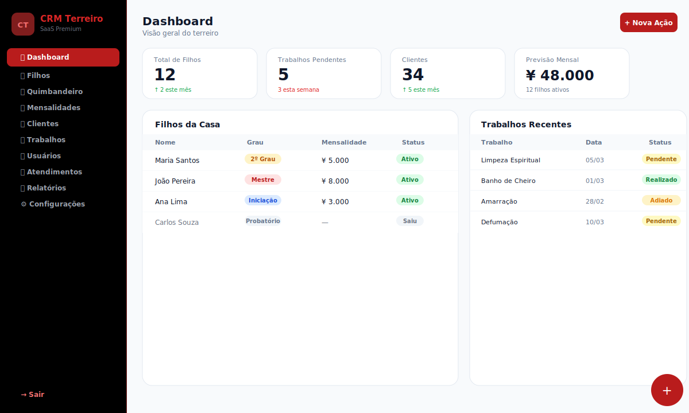

# CRM Terreiro

Sistema de gestão para terreiros de Umbanda/Quimbanda. Controla filhos da casa, graus de iniciação, trabalhos espirituais, mensalidades e atendimentos.



---

## Credenciais Padrão

> Execute `migrate.php` uma vez após instalar para criar o usuário admin automaticamente.

| Campo | Valor |
|---|---|
| **Email** | `admin@terreiro.com` |
| **Senha** | `123456` |
| **Perfil** | Administrador |

> ⚠️ Altere a senha após o primeiro acesso em **Usuários → Editar**.

---

## Stack

| Camada | Tecnologia |
|---|---|
| Frontend | HTML5 + Tailwind CSS (CDN) + Font Awesome 6.5 |
| Backend | PHP 8.2+ (PDO, sem framework) |
| Banco de Dados | MySQL 8 |
| Autenticação | Sessão PHP |

As tabelas são **criadas automaticamente** na primeira vez que cada página PHP é acessada (`CREATE TABLE IF NOT EXISTS`). Não é necessário rodar migrations manualmente.

---

## Estrutura de Arquivos

```
CRM-Terreiro/
├── index.html               # Login
├── dashboard.html/.php      # Visão geral e estatísticas
│
├── filhos.html/.php         # Cadastro de filhos da casa
├── quimbandeiro.html/.php   # Graus de iniciação por filho
├── mensalidades.html/.php   # Mensalidades e lançamentos extras
│
├── trabalhos.html/.php      # Agendamentos/realizações de trabalhos
├── servicos.html            # Catálogo de tipos de trabalho (legado)
├── services.php             # Backend do catálogo de serviços
│
├── clientes.html            # Consulentes/clientes
├── clients.php
├── atendimentos.html        # Registro de atendimentos
├── attendances.php
│
├── usuarios.html            # Controle de usuários e acessos
├── users.php
├── relatorios.html          # Relatórios filtráveis
├── reports.php
├── configuracoes.html       # Nome do terreiro e logo
├── settings.php
│
├── db.php                   # Conexão PDO + helpers jsonResponse/requireField
├── backup.php               # Backup do banco
├── migrate.php              # Migrações pontuais
│
└── database/
    ├── filhos_schema.sql        # Schema inicial de filhos
    └── schema_completo.sql      # Schema completo com todas as tabelas
```

---

## Banco de Dados — Tabelas

Todas as tabelas são criadas automaticamente pelo PHP. O script manual está em `database/schema_completo.sql`.

### `filhos`
Dados cadastrais dos filhos da casa.

| Coluna | Tipo | Descrição |
|---|---|---|
| id | INT PK | |
| name | VARCHAR(255) | Nome completo |
| email | VARCHAR(255) | Email (opcional) |
| phone | VARCHAR(50) | Telefone/WhatsApp |
| grade | ENUM | Iniciação / 1º / 2º / 3º Grau / Mestre |
| mensalidade_value | INT | Valor da mensalidade em centavos (JPY) |
| due_day | INT | Dia do mês para vencimento (1–28) |
| notes_evolucao | TEXT | Observações de evolução espiritual |

> Ao criar um filho, o sistema **automaticamente** cria um registro em `mensalidades_lancamentos` e em `quimbandeiro_graus`.

---

### `mensalidades_pagas`
Controle do pagamento mensal automático (um registro por filho por mês).

| Coluna | Tipo | Descrição |
|---|---|---|
| filho_id | INT FK | |
| paid_month | DATE | Primeiro dia do mês de referência |
| amount | INT | Valor pago em centavos |
| paid_at | DATETIME | |

Chave única: `(filho_id, paid_month)` — evita duplicata.

---

### `mensalidades_lancamentos`
Cobranças manuais extras criadas via botão **Nova Mensalidade**.

| Coluna | Tipo | Descrição |
|---|---|---|
| filho_id | INT FK | |
| valor | INT | Em centavos |
| data_vencimento | DATE | |
| pago | TINYINT | 0 = pendente, 1 = pago |
| data_pagamento | DATE | Quando foi dado baixa |
| descricao | VARCHAR(512) | Descrição livre |

---

### `quimbandeiro_graus`
Registro de progresso de iniciação de cada filho. Um único registro por filho (`UNIQUE filho_id`).

| Coluna | Tipo | Descrição |
|---|---|---|
| filho_id | INT FK UNIQUE | |
| probatorio | DATE | Data do período probatório |
| link_iniciacao | VARCHAR(512) | Link do vídeo/documento de iniciação |
| mao_buzios | DATE | Data da mão de búzios |
| mao_faca | DATE | Data da mão de faca |
| grau1 | DATE | Data do 1º Grau |
| grau2 | DATE | Data do 2º Grau |
| grau3 | DATE | Data do 3º Grau |

Campos `NULL` = etapa ainda não concluída (exibido como ⬜ pendente na tela).

---

### `trabalhos`
Catálogo de tipos de trabalho (ex: Limpeza, Amarração, Banho de Cheiro).

| Coluna | Tipo | Descrição |
|---|---|---|
| name | VARCHAR(255) | Nome do trabalho |
| description | TEXT | |
| price | INT | Preço em centavos |
| is_active | TINYINT | 1 = ativo |

---

### `trabalho_realizacoes`
Agendamentos e realizações concretas de trabalhos.

| Coluna | Tipo | Descrição |
|---|---|---|
| trabalho_id | INT FK | Tipo de trabalho do catálogo |
| cliente_nome | VARCHAR(255) | Nome do consulente (opcional) |
| data_realizacao | DATE | Data prevista/realizada |
| status | ENUM | `Pendente` / `Realizado` / `Adiado` |
| nova_data | DATE | Nova data se adiado |
| observacoes | TEXT | |

---

## Páginas e Funcionalidades

### Dashboard (`dashboard.html`)
- Contadores: clientes, trabalhos em andamento, tipos de trabalho, previsão mensal
- Lista dos atendimentos recentes com modal de edição ao clicar na linha
- Lista de mensalidades do mês atual
- Botão **Nova Ação** + FAB `+` para atalhos rápidos

---

### Filhos (`filhos.html`)
- Listagem com nome, grau, mensalidade e telefone (link WhatsApp)
- **Clicar na linha** → modal de detalhe com opções Editar, Excluir e atalho para Quimbandeiro
- Modal de cadastro/edição com todos os campos
- FAB `+` abre modal de novo filho
- Ao **criar** filho: cria automaticamente mensalidade inicial + registro Quimbandeiro

---

### Quimbandeiro (`quimbandeiro.html`)
- Tabela de todos os filhos com indicadores visuais por etapa:
  - ✅ Verde com data = etapa concluída
  - ⬜ Cinza = etapa pendente
- **Clicar na linha** → modal de detalhe com todas as datas e link de iniciação
- Botão **Editar** → modal de edição com inputs de data para cada etapa
- Etapas: Probatório · Link Iniciação · Mão de Búzios · Mão de Faca · 1º Grau · 2º Grau · 3º Grau

---

### Mensalidades (`mensalidades.html`)
Dividida em duas seções:

**Mensalidades do Mês Atual** — geradas automaticamente a partir dos filhos cadastrados
- Exibe filho, grau, dia de vencimento, valor, status (Pago / Pendente / Em Atraso)
- Clicar na linha → modal de detalhe com opção Dar Baixa

**Lançamentos Extras** — cobranças avulsas criadas manualmente
- Clicar na linha → modal de detalhe com opção Dar Baixa
- Botão **Nova Mensalidade** + FAB `+` → modal com campos:
  - Filho (seleção)
  - Valor (¥)
  - Data de Vencimento
  - Descrição (opcional)

---

### Trabalhos (`trabalhos.html`)
- Listagem de agendamentos com: Trabalho, Cliente, Data de Realização (📅), Status, Nova Data
- **Filtros**: Todos / Pendentes / Realizados / Adiados
- **Clicar na linha** → modal de detalhe
- Botão **Novo Trabalho** + FAB `+` → modal com:
  - Tipo de Trabalho (select do catálogo)
  - Cliente/Consulente
  - Data de Realização (campo de data)
  - Status: `Pendente` / `Realizado` / `Adiado`
  - Nova Data (aparece só se Adiado)
  - Observações
- Botão **Catálogo** → modal para gerenciar os tipos de trabalho (nome, descrição, preço)

---

### Clientes (`clientes.html`)
- CRUD de consulentes/clientes com nome, telefone, email
- Clicar na linha abre modal de detalhe/edição

---

### Atendimentos (`atendimentos.html`)
- Registro de atendimentos com cliente, serviços, pagamento e observações
- Flags: Inadimplente / Trabalho Revertido

---

### Usuários (`usuarios.html`)
- Controle de login: nome, email, role (admin/staff), senha

---

### Relatórios (`relatorios.html`)
- Filtros por período, cliente e serviço
- Exportação de dados de atendimentos

---

### Configurações (`configuracoes.html`)
- Nome do terreiro (exibido no topo da sidebar)
- Upload de logotipo

---

## Visual / Design System

### Cores do Menu
```
Sidebar:          bg-black        (fundo preto)
Borda:            border-red-900
Item ativo:       bg-red-700 text-white font-bold
Item inativo:     text-gray-400 hover:bg-red-800 hover:text-white font-bold
Sair:             text-red-400 hover:bg-red-900 font-bold
Brand:            text-red-600 font-black
```

### Padrões de Componente
- **FAB** — botão `+` fixo `bottom-6 right-6 bg-red-700 w-14 h-14 rounded-full` presente em todas as páginas
- **Clicar na linha da tabela** → abre modal de detalhe em todas as páginas
- **Botões de ação (Editar/Excluir)** dentro da tabela usam `onclick="event.stopPropagation()"` para não disparar o modal de detalhe
- **Valores monetários**: armazenados como INT em centavos (JPY), formatados como `¥x` no frontend

### Funções JS padrão em todas as páginas
```js
toggleModal(el, show)   // abre/fecha qualquer modal
formatBRL(value)        // INT centavos → "¥x"
parseBRL(value)         // "¥x" → INT centavos
fmtDate(dateStr)        // "YYYY-MM-DD" → "DD/MM/YYYY"
loadBrand()             // carrega nome/logo de settings.php
```

---

## API PHP — Padrão de Resposta

Todos os endpoints retornam JSON:

```json
{ "ok": true, "data": [...] }
{ "ok": true, "id": 42 }
{ "ok": false, "message": "Erro descritivo" }
```

Helpers definidos em `db.php`:
- `db()` — retorna conexão PDO
- `jsonResponse(array, status)` — emite JSON e encerra
- `requireField(field, message)` — valida campo POST obrigatório

---

## Instalação

### Pré-requisitos
- PHP 8.2+ com extensão `pdo_mysql`
- MySQL 8+
- Servidor web (Apache/Nginx) ou PHP built-in server

### Configuração

1. Clone o repositório:
```bash
git clone <url>
cd CRM-Terreiro
```

2. Configure o banco no `.env` (ou direto em `db.php`):
```
DB_HOST=localhost
DB_NAME=crm_terreiro
DB_USER=root
DB_PASS=senha
```

3. Crie o banco de dados:
```sql
CREATE DATABASE crm_terreiro CHARACTER SET utf8mb4 COLLATE utf8mb4_unicode_ci;
```

4. (Opcional) Importe o schema manualmente:
```bash
mysql -u root -p crm_terreiro < database/schema_completo.sql
```

5. Suba o servidor:
```bash
php -S localhost:8000
```

6. Acesse `http://localhost:8000`

> As tabelas são criadas automaticamente na primeira requisição a cada `.php`. Não é necessário rodar migrations.

---

## Changelog
---

## Security Visual — Screenshot/Print/Copy Block

### English

Since v3.1 (March 2026), all main pages have a security overlay that blocks the content when a screenshot, print screen, copy, or loss of focus is detected (mobile/desktop). All such attempts are logged and visible to administrators in the Settings page.

**How it works:**
- Overlay hides sensitive content when PrintScreen, copy, or focus loss is detected
- Event is logged with user, page, IP, and user agent
- Admins can view logs in Settings > Screenshot/Copy Logs

**Pages protected:**
- Expenses (Gastos)
- Users
- Jobs
- Services
- Reports
- Quimbandeiro

This feature increases privacy and prevents unauthorized sharing of sensitive information.

---

### Português

Desde a versão 3.1 (março de 2026), todas as páginas principais possuem um overlay de segurança que bloqueia o conteúdo ao detectar tentativa de print, screenshot, cópia ou perda de foco (mobile/desktop). Todas as tentativas são registradas e ficam visíveis para administradores na página de Configurações.

**Como funciona:**
- Overlay oculta o conteúdo ao detectar PrintScreen, cópia ou perda de foco
- Evento é registrado com usuário, página, IP e user agent
- Admin visualiza os logs em Configurações > Logs de Prints/Cópias

**Páginas protegidas:**
- Gastos
- Usuários
- Trabalhos
- Serviços
- Relatórios
- Quimbandeiro

Esse recurso aumenta a privacidade e previne o compartilhamento não autorizado de informações sensíveis.

### v3.0 — Março 2026
- **Visual**: sidebar totalmente reformulada → fundo **preto**, destaque **vermelho bold**
- **FAB** (`+`) adicionado em todas as páginas
- **Modal de detalhe** ao clicar em qualquer linha de tabela
- **Quimbandeiro** — nova seção para acompanhamento de graus de iniciação
  - Campos: Probatório, Link Iniciação, Mão de Búzios, Mão de Faca, 1º/2º/3º Grau
  - Record criado automaticamente ao cadastrar filho
- **Trabalhos** — substituiu "Serviços" com funcionalidade de rastreamento de realizações
  - Status: Pendente / Realizado / Adiado + nova data quando adiado
  - Calendário de data de realização em cada item
  - Catálogo de tipos de trabalho gerenciável
- **Mensalidades** — nova aba de Lançamentos Extras
  - Botão "Nova Mensalidade" com campos: Filho, Valor, Data de Vencimento
  - Ao criar filho → mensalidade inicial criada automaticamente
- **Termo "Serviço" → "Trabalho"** em todo o sistema
- **Tabelas MySQL novas**: `quimbandeiro_graus`, `trabalhos`, `trabalho_realizacoes`, `mensalidades_lancamentos`

### v2.0 — 2025
- Refatoração do frontend para HTML + Tailwind (saída do React)
- Sistema de filhos com grau hierárquico e mensalidade integrada
- Módulo de atendimentos com flags (inadimplente / revertido)
- Configurações: nome do terreiro e logo

### v1.0 — 2024
- Versão inicial com React + PHP API
- CRUD básico de clientes, serviços e atendimentos

---

Direitos Autorais: Andre Silva
